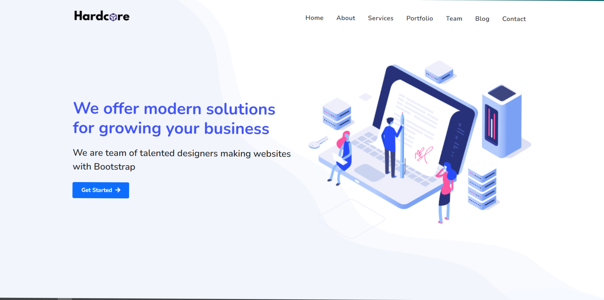

# multipage-web
Best example for beginners. multipage website with full responsive. 

<!-- ## Live Preview: [Open Link](https://hardcoresolution.netlify.app/) -->

Coded by - [Chandresh Pokiya](https://www.linkedin.com/in/chandresh-pokiya-1950751b7)

## Project Details

A simple looking web design for practice. We used HTML, CSS, Bootstrap and little bit of JavaScript. A clean design with full Responsive. Also we have added smooth scroll so user can get batter experience. And also we added multi pages in this website so this site will help for beginners.
This site is beginner-friendly Bootstrap project.

## Project Requirement

1. HTML, CSS
2. Bootstrap
3. JavaScript
